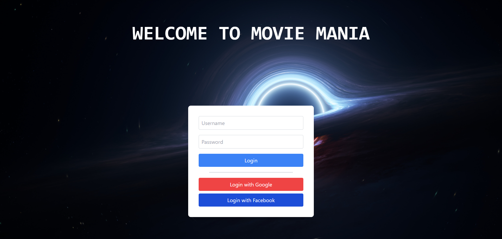
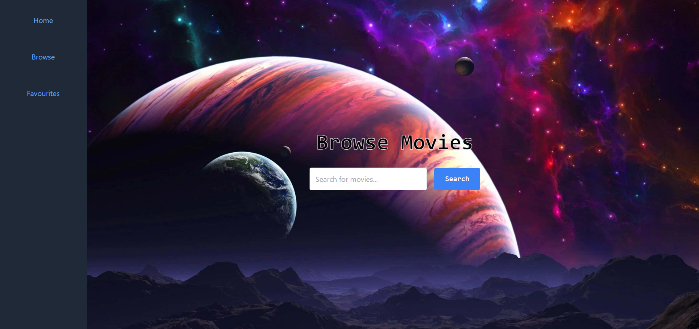
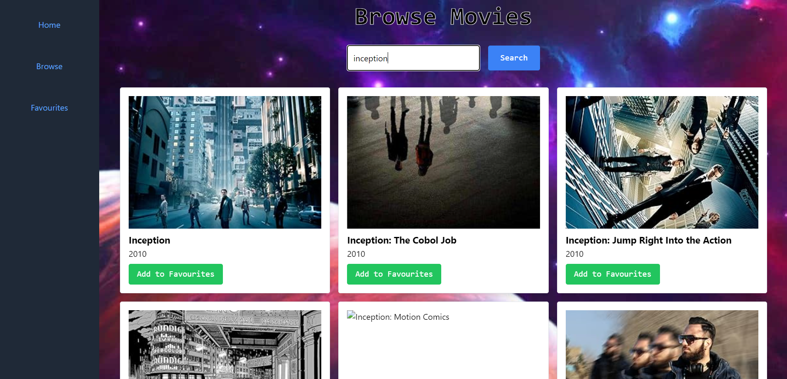
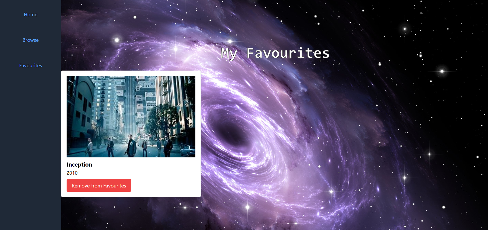

---

# Movie Mania 🎬

Welcome to **Movie Mania**, a React and Tailwind CSS-powered web application that allows users to browse movies, search for their favorite titles, and manage a personalized list of favorite movies. This project demonstrates a combination of modern front-end development practices, API integration, and responsive design principles.

## Table of Contents

- [Features](#features)
- [Technologies Used](#technologies-used)
- [Getting Started](#getting-started)
- [Project Structure](#project-structure)
- [How to Run](#how-to-run)
- [API Integration](#api-integration)
- [Screenshots](#screenshots)
- [Acknowledgements](#acknowledgements)

## Features

- **User Authentication**: Dummy login system to access the main features of the application.
- **Movie Browsing**: Browse through a collection of movies using the OMDb API.
- **Search Functionality**: Search for specific movies by title.
- **Favorites Management**: Add and remove movies from your favorites list.
- **Responsive Design**: The application is fully responsive and adjusts to various screen sizes.

## Technologies Used

- **React**: A JavaScript library for building user interfaces.
- **Tailwind CSS**: A utility-first CSS framework for styling.
- **React Router**: For handling client-side routing.
- **OMDb API**: The Open Movie Database API for fetching movie data.

## Getting Started

To get started with this project, follow the instructions below.

### Prerequisites

- **Node.js**: Ensure that Node.js is installed on your machine.
- **npm**: Node Package Manager, which comes with Node.js.

### Installation

1. **Clone the repository**:
   ```bash
   git clone https://github.com/AashishBishokarma/Movie-Mania.git
   cd movie-mania
   ```

2. **Install dependencies**:
   ```bash
   npm install
   ```

3. **API Key Setup**:
   - Replace the placeholder `API_KEY` in `App.jsx` with your actual OMDb API key.

## Project Structure

- **`src/`**: Contains all the source code files.
  - **`App.jsx`**: The main component handling routes and state management.
  - **`components/`**: Directory containing all the UI components:
    - `Browse.jsx`: Handles the browsing and searching of movies.
    - `Favourites.jsx`: Manages the favorites list.
    - `Login.jsx`: Dummy login screen.
    - `Modal.jsx`: Confirmation modal for removing movies from favorites.
  - **`assets/`**: Contains static assets like images.
  
- **`public/`**: Public directory containing the `index.html` file and other static files.

## How to Run

**Start the development server**:
   ```bash
   npm run dev
   ```

## API Integration

This project utilizes the [OMDb API](http://www.omdbapi.com/) to fetch movie data based on user searches. Ensure you have a valid API key and replace it in the `App.jsx` file.

- Example API request:
  ```javascript
  const response = await fetch(`http://www.omdbapi.com/?apikey=${API_KEY}&s=${searchQuery}`);
  ```

## Screenshots

Include screenshots here to showcase your application.

- **Login Page**
  
- **Browse Page**
  
  
- **Favorites Page**
  

---